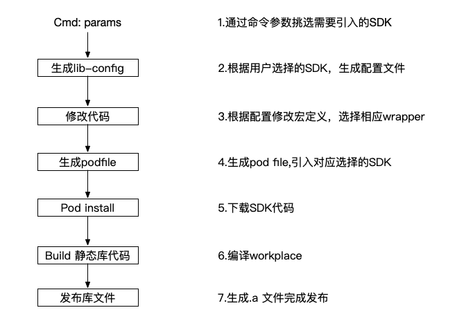
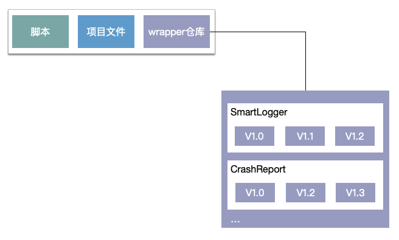
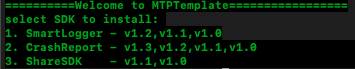
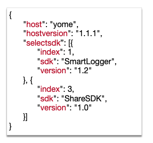
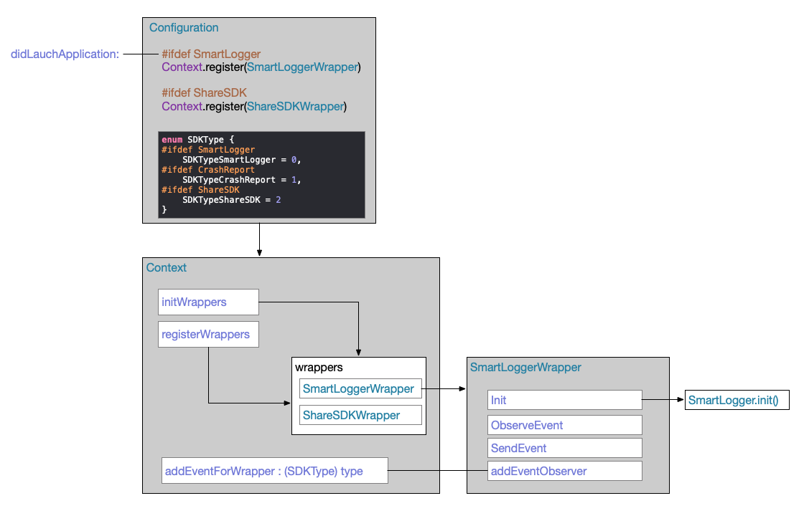

# MTP模版配置方案

## 介绍

该方案旨在通过配置所选SDK，一键打包生成对应静态库，并自动管理初始化流程，从而简化对SDK导入的过程，提高生产效率。

## 流程



## 详细

整体结构分为三部分：脚本，项目文件，wrapper仓库



### 1.运行脚本

#### 1.1 输入指令：

**`./MTPTemplate.py -host=yome, -hostversion=1.1.1`**



脚本罗列出每个SDK可用版本号以供选择 ****

#### 1.2 挑选需要安装的SDK及版本，如无版本参数则默认**最新版本：**

**`select 1, 3～1.0`**  

·1-SmartLogger会以默认最新版1.2作为选择   
·3-ShareSDK则以指定1.0作为选择


### 2.生成配置文件



### 3.修改代码

根据配置文件，将项目文件中configure文件中相应的宏定义置为1，用于初始化挑选。

\#define SmartLogger   1  
\#define CrashReport    0  
\#define ShareSDK         1



### 4.生成Podfile

根据配置文件中各项SDK具体参数，在podfile中，指明需要下载的SDK及版本，每个SDK由两部分组成：wrapper+源代码，  
 `# SmartLogger  
    pod 'SmartLogger_wrapper', '1.2'  
    pod 'SmartLogger', '1.2'  
# ShareSDK  
    pod 'ShareSDK_wrapper', '1.0'  
    pod 'ShareSDK', '1.0'`  
  \* 源代码则指向远端git地址  
  \* wrapper指向本地pod，地址对应wrapper仓库路径`spec.subspec 'sources' do |ss|   
   ss.source_file = '../SmartLoggerWrapper/1.2/Source/*{h.m}'  
end`

### 5. Pod Install

 通过**cocopod** 的代码管理指令进行获取SDK。

### 6. 编译代码

 通过xcodebuild命令对拉取完SDK的项目代码进行编译

```text
xcodebuild archive 
           -archivePath <archivePath>
           -project <projectName>
           -workspace <workspaceName>
           -scheme <schemeName>    
           -configuration <Debug|Release>
```

### 7.发布库文件

将生成的.a库与头文件Push到远端git,同时以此次打包行为以业务方命名打Tag，e.g：yome\_1.1.1  
最后返回输出：

`pod 'MTPLibrary ' , 'yome_1.1.1'`

供开发者直接在其项目中使用

