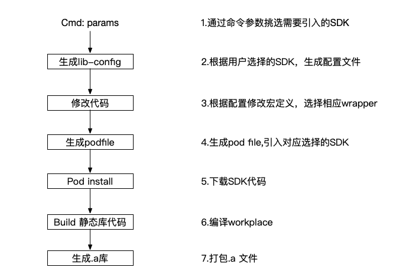
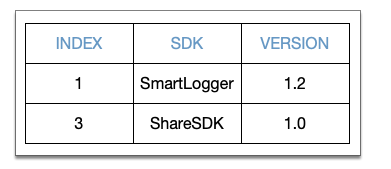

# MTP模版配置方案

## 介绍

该方案旨在通过配置所选SDK，一键打包生成对应静态库，并自动管理初始化流程，从而简化对SDK导入的过程，提高生产效率。

## 流程

## 详细

整体结构分为三部分：脚本，项目文件，wrapper仓库

### 1.运行脚本

1.1 输入指令：

**`./MTPTemplate.py`**

1.2 挑选需要安装的SDK及版本，如无版本参数则默认**最新版本：**

**`select 1, 3～1.0`**  

·1-SmartLogger会以默认最新版1.2作为选择   
·3-ShareSDK则以指定1.0作为选择

### 2.生成配置文件

### 3.修改代码

根据配置文件，将项目文件中configure文件中相应的宏定义置为1，用于初始化挑选。

\#define SmartLogger   1  
\#define CrashReport    0  
\#define ShareSDK         1

### 4.生成Podfile

根据配置文件中各项SDK具体参数，在podfile中，指明需要下载的SDK及版本，每个SDK由两部分组成：wrapper路径+源代码地址，  
\* wrapper路径即本地wrapper仓库的路径，作为本地pod  
\* 源代码则指向远端git地址  
 `# SmartLogger  
    pod 'SmartLogger_wrapper', :path => '../../SmartLogger/SmartLoggerWrapper_v_1_2'  
    pod 'SmartLogger', '1.2'  
# ShareSDK  
    pod 'ShareSDK_wrapper', :path => '../../ShareSDK/ShareSDKWrapper_v_1_0'  
    pod 'ShareSDK', '1.0'`

### 5. Pod Install

 通过**cocopod** 的代码管理指令进行获取SDK。

### 6. 编译代码

 

